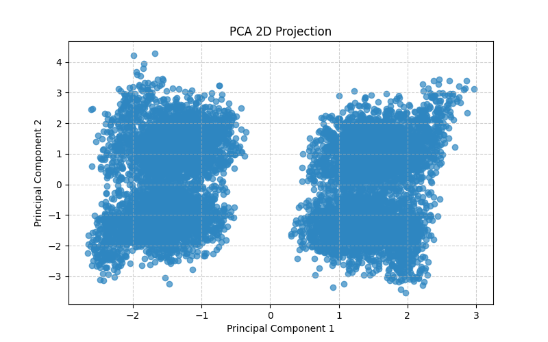
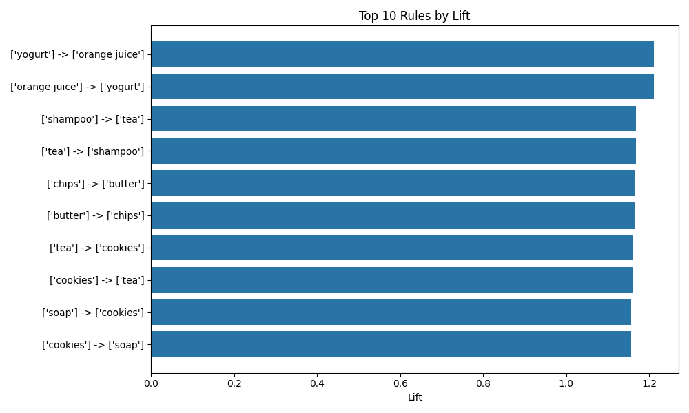

# Data Mining Project Report

## 1. Project Overview
This report details the implementation and findings of two key data mining projects:
1.  **PCA (Principal Component Analysis)**: Focusing on data cleaning, preprocessing, and dimensionality reduction.
2.  **Association Rule Mining (ARM)**: Focusing on transactional data cleaning and discovering relationships between items.

## 2. Project 1: Data Preprocessing & PCA

### 2.1 Methodology & Steps
The goal was to audit a noisy dataset (`Non-Transactional_Dataset.csv`) and apply PCA to reduce dimensions while retaining variance.

1.  **Data Auditing**:
    *   Identified missing values, unrealistic numeric ranges (e.g., negative ages), and outliers using IQR.
    *   Detected categorization issues (e.g., "Male", "male", "M" inconsistency).
2.  **Data Cleaning**:
    *   **Standardization**: Column names normalized to lower_case_snake_case.
    *   **Correction**: Inconsistent gender labels mapped to "male"/"female"; unrealistic values set to NaN.
    *   **Imputation**: Numerical missing values filled with median; categorical with mode.
    *   **Outlier Handling**: Capped values using IQR method.
3.  **PCA Implementation**:
    *   Categorical variables One-Hot Encoded.
    *   Data scaled using `StandardScaler` (and `MinMaxScaler` for comparison).
    *   Reduced to 3 principal components.

### 2.2 Findings & Output
The PCA analysis revealed the explained variance ratio for the principal components.

**Explained Variance (StandardScaler):**
*   **PC1**: 0.0009
*   **PC2**: 0.0008
*   **PC3**: 0.0007
*   **Total Explained Variance**: 0.0024

> [!NOTE]
> The low explained variance suggests the synthetic/random nature of the dataset or high noise levels.

**Visualization:**
The 2D projection of the first two principal components shows the data distribution in the new feature space.

---

## 3. Project 2: Association Rule Mining

### 3.1 Methodology & Steps
The goal was to discover purchasing patterns in a transactional dataset (`Transactional_Dataset.csv`).

1.  **Data Auditing**:
    *   Checked for missing dates/amounts and duplicated transactions.
    *   Identified formatting consistency issues (e.g., semicolons vs commas in item lists).
2.  **Data Cleaning**:
    *   **Dates**: Parsed mixed date formats; dropped invalid rows.
    *   **Amounts**: Coerced to numeric, filled missing with mean.
    *   **Text Cleaning**: Standardized location names (e.g., "Cai" -> "Cairo") and normalized discount flags.
    *   **Item Parsing**: Split `items_purchased` by commas/semicolons, stripped whitespace, and deduplicated items per transaction.
3.  **Apriori Algorithm**:
    *   Applied `TransactionEncoder` to convert item lists to a boolean matrix.
    *   Generated frequent itemsets with **Min Support = 0.01**.
    *   Generated rules with **Min Confidence = 0.01**.

### 3.2 Findings & Output
The mining process successfully identified association rules. The top rules by **Lift** indicate strong relationships between specific items.

**Top Association Rules:**
| Antecedents | Consequents | Lift | Confidence | Support |
| :--- | :--- | :--- | :--- | :--- |
| (yogurt) | (orange juice) | 1.21 | 0.17 | 0.023 |
| (orange juice) | (yogurt) | 1.21 | 0.17 | 0.023 |
| (shampoo) | (tea) | 1.17 | 0.17 | 0.024 |
| (tea) | (shampoo) | 1.17 | 0.16 | 0.024 |
| (chips) | (butter) | 1.17 | 0.17 | 0.023 |

> [!TIP]
> A Lift > 1.0 indicates a positive association—items are more likely to be bought together than chance would predict.

**Visualization:**
The bar chart below illustrates the top 10 rules ranked by Lift, highlighting the strongest product pairings.

## 4. Conclusion
The project successfully implemented a full data mining pipeline. The GUI (Streamlit) provides an interactive layer over this logic, allowing users to upload datasets and dynamically view these audits and results. 

*   **Project 1** effectively cleans noisy demographic data and prepares it for ML tasks like PCA.
*   **Project 2** robustly parses messy transactional strings to unlock actionable market basket insights.
